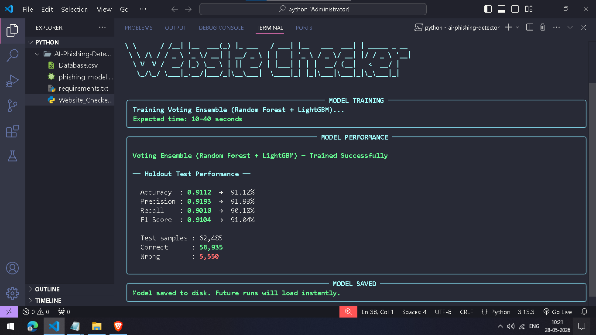
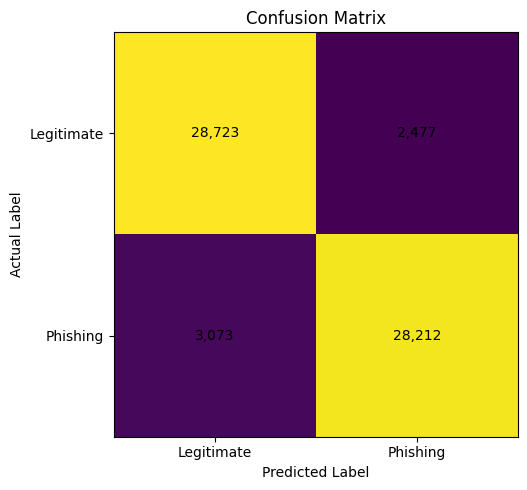

# AI-Based Phishing Detection System

An intelligent phishing detection system designed to identify malicious websites using Machine Learning, Heuristic Analysis, and Threat Intelligence.

## Overview

Phishing attacks remain one of the most common cybersecurity threats, targeting individuals and organizations through fraudulent websites and deceptive online content. This project aims to improve phishing detection by combining multiple security techniques into a single detection framework.

The system analyzes website characteristics, evaluates risk indicators, and leverages threat intelligence sources to classify websites as legitimate or potentially malicious.

## Features

- URL Feature Extraction and Analysis
- Machine Learning-Based Classification
- Heuristic Risk Scoring
- Threat Intelligence Integration
- Real-Time Website Assessment
- Automated Security Evaluation

## Technologies Used

- Python
- Scikit-learn
- Pandas
- NumPy
- Random Forest
- Google Safe Browsing API
- VirusTotal API

## Detection Factors

The system evaluates multiple security indicators, including:

- URL Length
- HTTPS Usage
- Domain Characteristics
- Suspicious Keywords
- Presence of IP Addresses in URLs
- Subdomain Analysis
- Special Characters and Symbols
- Threat Intelligence Reputation Data

## Performance

| Metric | Score |
|----------|----------|
| Accuracy | 91.12% |
| Precision | 91.93% |
| Recall | 90.18% |
| F1-Score | 91.04% |

## Applications

- Phishing Website Detection
- Security Awareness Training
- Threat Intelligence Research
- Website Reputation Analysis
- Cybersecurity Education

## Skills Demonstrated

- Machine Learning
- Cybersecurity Analysis
- Threat Detection
- Python Development
- Data Analysis
- Security Research
- API Integration

Cybersecurity Graduate | IT & Cybersecurity Professional

## Results
Model Performace



Confusion Matrix


## Installation

```bash
pip install -r requirements.txt

...

## Contact

🔗 LinkedIn: [Shushant Singh Kathait](https://www.linkedin.com/in/shushant-singh-kathait-0260a038a/)
